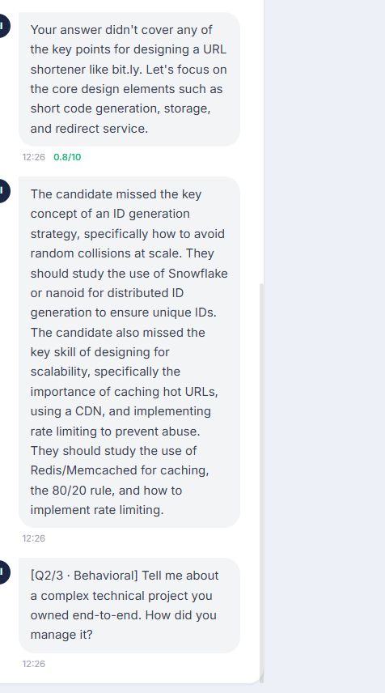
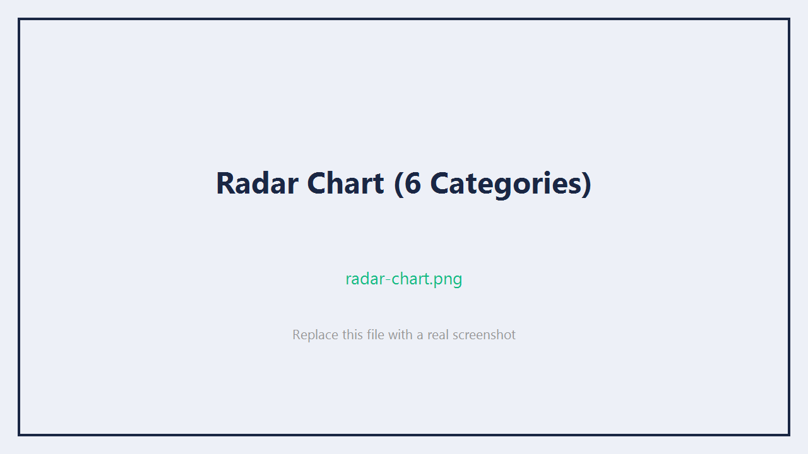
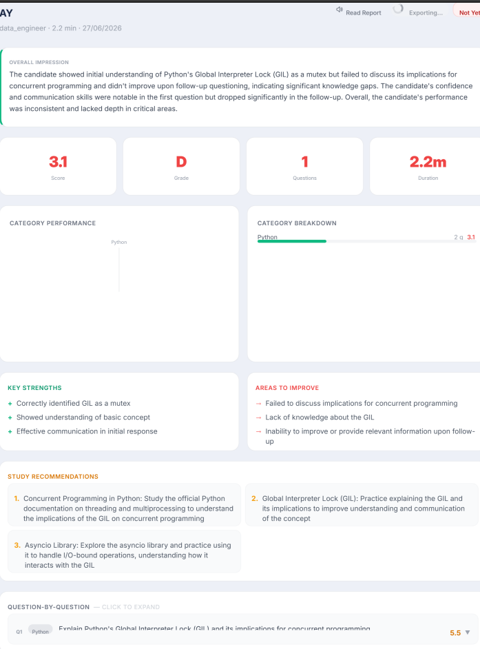

# TechMind AI — Voice Interview Agent

<div align="center">

**Voice → STT → RAG Grounding → LLM Interviewer → TTS → Structured Report**

*AI Assignment — Voice Interview Pipeline*

[](https://python.org)
[](https://fastapi.tiangolo.com)
[](https://nextjs.org)
[](https://groq.com)
[](https://faiss.ai)
[](#)

**[Live Demo (Render + Vercel)](#deployment)** · **[API Docs](http://localhost:8000/docs)** · **[Architecture](ARCHITECTURE.md)**

</div>

---

## Screenshots

<table>
<tr>
<td width="50%" valign="top">

**Landing Page** — configure role, difficulty, question count


</td>
<td width="50%" valign="top">

**Interview Room** — live waveform, transcript, agent speaking indicator


</td>
</tr>
<tr>
<td width="100%" valign="top" colspan="2">

**Live Transcript** — agent messages + user answers, timestamped



</td>
</tr>
<tr>
<td width="50%" valign="top">

**Radar Chart** — 6-axis skill coverage visualization



</td>
<td width="50%" valign="top">

**PDF Report** — downloadable full evaluation report



</td>
</tr>
</table>

> **To add screenshots:** run the app, take screenshots of each page, and save them as the filenames above inside `docs/screenshots/`.

---

## What It Does

TechMind AI runs a **complete technical interview end-to-end** — no human interviewer needed:

```
You speak         →   STT              →   Grounded Eval      →   Agent speaks
(microphone)          Groq Whisper          FAISS + LLaMA          edge-tts
                       < 300 ms             3.3 70B               MP3 over WS
```

**5-Stage Pipeline:**

1. **Voice In** — Browser `MediaRecorder` captures audio. Sent via REST to Groq Whisper (`whisper-large-v3-turbo`). Transcript returned in < 300 ms.
2. **Grounding** — Before scoring, FAISS vector search fetches the canonical reference answer and key points from the curated Q&A dataset. The LLM **never evaluates from memory alone**.
3. **LLM Interviewer** — LLaMA 3.3 70B acts as a real interviewer: asks the next question, generates a follow-up when an answer is weak (score 5–8), or gives a 2-sentence corrective hint for very weak answers (score < 5).
4. **Voice Out** — Every agent response is synthesised via Microsoft Neural TTS (`edge-tts`) and streamed back as base64 MP3 over WebSocket. Sub-second playback latency.
5. **Structured Feedback** — After all questions, a full report is generated: overall score, grade (A–F), per-question breakdown with ideal answers, radar chart by category, strengths, improvement areas, and a hiring signal. Downloadable as PDF.

---

## How Each Deliverable Is Met

### 1 — Voice Input (STT)

| What | Where | Detail |
|------|-------|--------|
| Browser audio capture | `useAudioRecorder.ts` | `MediaRecorder` + `AnalyserNode` for live waveform |
| Groq Whisper transcription | `backend/app/services/stt_service.py` | `whisper-large-v3-turbo`, < 300 ms p50 |
| Real-time transcript display | `InterviewRoom.tsx` → transcript panel | Shows as user speaks; final on submit |
| Multi-language STT | Groq Whisper | English · Hindi · German |

### 2 — Grounding (RAG Retrieval)

| What | Where | Detail |
|------|-------|--------|
| Q&A knowledge base | `backend/app/data/qa_dataset.json` | 31 curated questions across 9 categories |
| Embedding model | `retrieval_service.py` | `BAAI/bge-small-en-v1.5` via fastembed (ONNX, ~80 MB) |
| Vector index | FAISS `IndexFlatIP` | Cosine similarity via L2-normalised inner product |
| Direct reference lookup | `evaluate_answer()` | Fetches exact reference by `question_id` |
| Supplementary context | FAISS top-2 search on answer text | Related Q&As for broader context |
| Index caching | `embeddings_cache.npz` + `faiss.index` | Cold start < 1s after first build |

### 3 — LLM Interviewer

| Behaviour | Trigger | Implementation |
|-----------|---------|---------------|
| Ask question | Session start / after previous answer | `deliver_question()` in `interview_engine.py` |
| Follow-up probe | Score 5–8 | `generate_follow_up()` — targets exact weakness |
| Corrective hint | Score < 5 | `generate_teaching()` — exactly 2 sentences, max 80 tokens |
| Advance to next | Score ≥ 8 | Transition phrase → `deliver_question()` |
| End of interview | All questions complete | `finalize()` → summary generation |

### 4 — Voice Output (TTS)

| What | Where | Detail |
|------|-------|--------|
| Neural TTS synthesis | `tts_service.py` | Microsoft Neural via `edge-tts` |
| Languages | EN / HI / DE | `en-US-JennyNeural` · `hi-IN-SwaraNeural` · `de-DE-KatjaNeural` |
| Audio delivery | WebSocket | base64 MP3 in `audio` field of each event |
| Browser fallback | `useAudioPlayer.ts` | `window.speechSynthesis` if MP3 unavailable |
| Sequential playback | FIFO task queue | No audio cutoff — each item awaits completion |

### 5 — Structured Feedback (End of Interview)

| What | Where | Detail |
|------|-------|--------|
| Overall score (0–10) | `/results` page | Weighted average across all evaluated answers |
| Grade | A+ → F | Score-to-grade mapping |
| 6 sub-scores per question | Analytics dashboard | Accuracy · Communication · Completeness · Confidence · Structure · Examples |
| Ideal answer per question | Expandable card | Direct from Q&A dataset reference |
| Radar chart | `AnalyticsDashboard.tsx` | Category-level performance (Recharts) |
| Strengths / weaknesses | Summary section | LLM-generated from all evaluations |
| Hiring signal | `strong_yes / yes / maybe / no` | Based on overall score + pattern |
| PDF download | `PDFExport.tsx` | `jspdf` + `html2canvas` — full dashboard as PDF |

---

## 3-Tier Feedback Routing

```
Score ≥ 8   ──► "Good answer." + transition → Next question
Score 5–8   ──► Follow-up question targeting the exact weakness
Score < 5   ──► 2-sentence corrective hint (what was missing + what to study)
```

**6 Scoring Dimensions:** Accuracy (35%) · Completeness (25%) · Communication (20%) · Confidence (10%) · Structure (5%) · Examples (5%)

---

## Quick Start

### Prerequisites

- Python 3.10+
- Node.js 20+
- Free [Groq API key](https://console.groq.com) (takes 30 seconds to get)

---

### 1 — Backend

```bash
cd backend

# Set your Groq API key
cp .env.example .env
# Edit .env → GROQ_API_KEY=gsk_...

# Install dependencies
pip install -r requirements.txt

# Start the server
uvicorn app.main:app --reload --port 8000
```

First start downloads `BAAI/bge-small-en-v1.5` (~45 MB) and builds the FAISS index. Takes ~30s once. Every restart after that loads from cache in < 1s.

```bash
# Verify it's healthy
curl http://localhost:8000/health
# → {"status":"ok","retrieval_ready":true,"questions_loaded":31}
```

---

### 2 — Frontend

```bash
cd frontend

cp .env.example .env.local
# .env.local already points to localhost:8000 — no changes needed for local dev

npm install
npm run dev
```

Open **http://localhost:3000**

---

### 3 — Run an Interview

1. Enter your name, pick a role and difficulty, set question count (default: 3)
2. Click **Begin Interview**
3. Click **Start Interview** on the instructions screen
4. Wait for the agent to finish speaking — mic activates automatically when audio ends
5. Click **Start Speaking** → answer → **Done Speaking**
6. Receive verbal feedback, follow-up if needed, or a short corrective hint
7. After the final question, full report generated → auto-redirect to `/results`

---

## API Reference

All endpoints are also available at **http://localhost:8000/docs** (Swagger UI).

| Method | Endpoint | Description |
|--------|----------|-------------|
| `GET` | `/health` | Service health + retrieval status |
| `POST` | `/api/v1/sessions` | Create interview session |
| `GET` | `/api/v1/sessions/{id}` | Get session metadata |
| `GET` | `/api/v1/sessions/{id}/results` | Get full evaluation report |
| `POST` | `/api/v1/interview/{id}/submit-audio` | Submit voice answer (WAV/WebM) |
| `GET` | `/api/v1/interview/{id}/status` | Get current interview state |
| `WS` | `/ws/{session_id}` | Real-time event bus |

---

### Sample Responses

**`GET /health`**
```json
{
  "status": "ok",
  "retrieval_ready": true,
  "questions_loaded": 31
}
```

**`POST /api/v1/sessions`**
```json
// Request
{
  "candidate_name": "Ayush Sharma",
  "role": "backend",
  "difficulty": "medium",
  "language": "en",
  "question_count": 3
}

// Response
{
  "id": "550e8400-e29b-41d4-a716-446655440000",
  "candidate_name": "Ayush Sharma",
  "role": "backend",
  "status": "pending"
}
```

**`GET /api/v1/sessions/{id}/results`**
```json
{
  "session_id": "550e8400-e29b-41d4-a716-446655440000",
  "candidate_name": "Ayush Sharma",
  "role": "backend",
  "overall_score": 7.4,
  "grade": "B+",
  "hiring_signal": "yes",
  "overall_impression": "Strong understanding of fundamentals with gaps in distributed systems.",
  "category_scores": [
    { "category": "Python",        "score": 8.2, "question_count": 1 },
    { "category": "System Design", "score": 6.1, "question_count": 1 },
    { "category": "Behavioral",    "score": 7.9, "question_count": 1 }
  ],
  "evaluations": [
    {
      "question_text": "Explain Python's GIL and its implications.",
      "answer_text": "The GIL is a lock in CPython that...",
      "score": 8.2,
      "accuracy": 8.5, "communication": 8.0, "completeness": 7.8,
      "confidence": 8.0, "structure": 8.5, "examples_used": 8.5,
      "feedback": "Strong answer covering the core mechanism and threading implications.",
      "strengths": ["Correctly explained reference counting", "Mentioned asyncio alternative"],
      "weaknesses": ["Didn't mention C extensions releasing GIL"],
      "ideal_answer": "The GIL is a mutex in CPython that allows only one thread..."
    }
  ],
  "strengths": ["Strong Python fundamentals", "Clear communication"],
  "weaknesses": ["Limited distributed systems exposure"],
  "improvement_suggestions": ["Study CAP theorem and consistent hashing"],
  "interview_duration_minutes": 12,
  "completed_at": "2026-06-27T10:22:00Z"
}
```

**`POST /api/v1/interview/{id}/submit-audio`**
```json
// Multipart form: audio file (WAV/WebM) + is_follow_up flag
// Response
{
  "transcript": "The GIL is a lock that prevents multiple threads from executing Python bytecode simultaneously.",
  "duration_ms": 4200
}
```

### WebSocket Event Bus (`/ws/{session_id}`)

```
Client → Server
  { "type": "start" }           # Begin the interview
  { "type": "answer_ready" }    # Audio submitted via REST; process it
  { "type": "skip" }            # Skip current question
  { "type": "ping" }            # 25-second keepalive

Server → Client
  { "type": "connected",    "data": { "state": "IDLE", "total_questions": 3 } }
  { "type": "state_change", "data": { "state": "PROCESSING" } }
  { "type": "intro",        "data": { "text": "Hello! I'm TechMind AI...", "audio": "<base64 mp3>" } }
  { "type": "question",     "data": { "question_num": 1, "total_questions": 3,
                                       "question_text": "Explain Python's GIL...",
                                       "category": "Python", "difficulty": "medium",
                                       "audio": "<base64 mp3>" } }
  { "type": "transcript",   "data": { "text": "The GIL is...", "is_final": true } }
  { "type": "evaluation",   "data": { "score": 8.2, "feedback": "...", "audio": "<base64 mp3>",
                                       "accuracy": 8.5, "communication": 8.0, ... } }
  { "type": "follow_up",    "data": { "text": "Can you explain how C extensions...", "audio": "..." } }
  { "type": "teaching",     "data": { "text": "Your answer missed X. Study Y.", "audio": "...",
                                       "ideal_answer": "...", "key_points": ["..."] } }
  { "type": "transition",   "data": { "text": "Good. Next question.", "audio": "..." } }
  { "type": "summary",      "data": { "overall_score": 7.4, "grade": "B+", ... } }
  { "type": "error",        "data": { "message": "..." } }
  { "type": "pong" }
```

---

## Reference Q&A Dataset

Located at `backend/app/data/qa_dataset.json`. **31 curated questions** hand-crafted with reference answers and key evaluation points:

| Category | Count | Sample Question |
|----------|-------|----------------|
| Python | 5 | GIL, decorators, async/await, generators, memory management |
| Behavioral | 5 | STAR-format: ownership, conflict, improvement, failure, leadership |
| System Design | 4 | URL shortener, rate limiter, notification system, cache design |
| Data Structures | 4 | Trees, graphs, dynamic programming, sorting |
| JavaScript | 4 | Event loop, closures, promises, prototypes |
| React | 3 | Hooks, reconciliation, performance optimization |
| Databases | 3 | Indexing, ACID, query optimization |
| API Design | 2 | REST vs GraphQL, idempotency, pagination |
| TypeScript | 1 | Generics and type narrowing |

**Schema:**
```json
{
  "id": "py001",
  "category": "Python",
  "difficulty": "medium",
  "question": "Explain Python's Global Interpreter Lock (GIL)...",
  "reference_answer": "The GIL is a mutex in CPython that allows only one thread...",
  "key_points": [
    "GIL prevents true thread parallelism in CPython",
    "I/O-bound threads are unaffected — they release GIL during I/O waits",
    "multiprocessing bypasses GIL via separate processes",
    "asyncio offers cooperative concurrency without threads"
  ],
  "follow_up_questions": [
    "How would you design a CPU-intensive task to run efficiently in Python?"
  ],
  "tags": ["python", "concurrency", "GIL", "threading"]
}
```

**To add questions:** edit `qa_dataset.json`, delete `app/data/faiss.index` and `app/data/embeddings_cache.npz`, restart backend (index rebuilds automatically in ~30s).

---

## Project Structure

```
techmind-ai/
│
├── backend/
│   ├── app/
│   │   ├── main.py                      # FastAPI app entry, CORS, health endpoint
│   │   ├── config.py                    # Pydantic settings, loaded from .env
│   │   ├── database.py                  # Async SQLAlchemy + SQLite (aiosqlite)
│   │   ├── models/session.py            # Session model, InterviewState enum
│   │   ├── data/
│   │   │   └── qa_dataset.json          # ← The curated Q&A knowledge base (31 Q&As)
│   │   ├── prompts/
│   │   │   ├── evaluation_prompt.md     # Grounded rubric scoring (6 axes, JSON output)
│   │   │   ├── followup_prompt.md       # Follow-up question generation
│   │   │   ├── teaching_prompt.md       # 2-sentence corrective hint (max 80 tokens)
│   │   │   └── feedback_prompt.md       # End-of-interview summary generation
│   │   └── services/
│   │       ├── retrieval_service.py     # fastembed + FAISS: embed, index, search
│   │       ├── stt_service.py           # Groq Whisper transcription
│   │       ├── tts_service.py           # edge-tts synthesis (EN / HI / DE)
│   │       ├── llm_service.py           # Groq LLM wrapper with exponential retry
│   │       ├── evaluation_service.py    # evaluate_answer · follow_up · teaching · summary
│   │       ├── interview_engine.py      # InterviewSession state machine
│   │       └── prompt_loader.py         # lru_cache prompt loading from .md files
│   │   └── api/routes/
│   │       ├── sessions.py              # POST /sessions · GET /sessions/{id}/results
│   │       ├── interview.py             # POST /interview/{id}/submit-audio
│   │       └── websocket.py             # WS /ws/{id} — real-time event bus
│   ├── .env.example
│   ├── requirements.txt
│   └── Dockerfile
│
├── frontend/
│   └── src/
│       ├── app/
│       │   ├── page.tsx                 # Landing page — interview config form
│       │   ├── interview/page.tsx       # Live interview room
│       │   └── results/[id]/page.tsx   # Analytics report + PDF download
│       ├── components/
│       │   ├── interview/
│       │   │   ├── InterviewRoom.tsx    # Main interview UI (state-driven)
│       │   │   └── AudioWaveform.tsx    # Live waveform visualizer
│       │   └── analytics/
│       │       ├── AnalyticsDashboard.tsx  # Full report: charts, scores, ideal answers
│       │       └── PDFExport.tsx           # jspdf + html2canvas PDF generation
│       ├── hooks/
│       │   ├── useAudioPlayer.ts        # FIFO audio queue: MP3 + browser TTS fallback
│       │   ├── useAudioRecorder.ts      # MediaRecorder + AnalyserNode (waveform)
│       │   ├── useWebSocket.ts          # WS client, auto-reconnect, exponential backoff
│       │   └── useInterview.ts          # Promise-based task queue — core audio sync
│       ├── lib/
│       │   ├── types.ts                 # All TypeScript interfaces
│       │   └── api.ts                   # Typed REST client
│       └── store/interviewStore.ts      # Zustand global state
│
└── docs/
    └── screenshots/                     # Add screenshots here (see list below)
```

---

## Deployment

### Backend → Render

1. Push this repo to GitHub
2. Go to [render.com](https://render.com) → **New** → **Web Service**
3. Connect your GitHub repo → select the **`backend/`** directory as root
4. Fill in settings:
   ```
   Name:          techmind-ai-backend
   Runtime:       Python 3
   Build Command: pip install -r requirements.txt
   Start Command: uvicorn app.main:app --host 0.0.0.0 --port $PORT --workers 1
   ```
5. Add environment variable:
   ```
   GROQ_API_KEY = gsk_your_key_here
   ```
6. Add a **Disk** (under Advanced):
   ```
   Name:       techmind-data
   Mount Path: /app/app/data
   Size:       1 GB
   ```
   This persists the SQLite database and FAISS cache across deploys.
7. Click **Create Web Service**

> First deploy takes ~60s (downloads fastembed model + builds index). After that, warm restarts are ~3s.

---

### Frontend → Vercel

1. Go to [vercel.com](https://vercel.com) → **New Project**
2. Import your GitHub repo
3. Set **Root Directory** to `frontend`
4. Add environment variables:
   ```
   NEXT_PUBLIC_API_URL = https://your-backend-name.onrender.com
   NEXT_PUBLIC_WS_URL  = wss://your-backend-name.onrender.com
   ```
5. Click **Deploy**

> Replace `your-backend-name` with your actual Render service URL.

---

### Verify Production Deployment

```bash
# Health check
curl https://your-backend.onrender.com/health
# → {"status":"ok","retrieval_ready":true,"questions_loaded":31}

# Create a session
curl -X POST https://your-backend.onrender.com/api/v1/sessions \
  -H "Content-Type: application/json" \
  -d '{"candidate_name":"Test","role":"backend","difficulty":"medium","language":"en","question_count":3}'
```

---

## Environment Variables

### Backend (`backend/.env`)

| Variable | Default | Required | Description |
|----------|---------|----------|-------------|
| `GROQ_API_KEY` | — | **Yes** | Groq API key from console.groq.com |
| `GROQ_MODEL` | `llama-3.3-70b-versatile` | No | LLM for evaluation + summary |
| `GROQ_FAST_MODEL` | `llama-3.1-8b-instant` | No | LLM for follow-up + teaching |
| `GROQ_WHISPER_MODEL` | `whisper-large-v3-turbo` | No | Groq Whisper STT model |
| `DATABASE_URL` | `sqlite+aiosqlite:///./app/data/interview.db` | No | Database connection string |
| `CORS_ORIGINS` | `http://localhost:3000` | No | Allowed frontend origins (comma-separated) |
| `TEACH_SCORE_THRESHOLD` | `5.0` | No | Score below which teaching triggers (< 5 = teach) |
| `FOLLOW_UP_SCORE_THRESHOLD` | `8.0` | No | Score below which follow-up triggers (< 8 = probe) |

### Frontend (`frontend/.env.local`)

| Variable | Default | Description |
|----------|---------|-------------|
| `NEXT_PUBLIC_API_URL` | `http://localhost:8000` | Backend REST base URL |
| `NEXT_PUBLIC_WS_URL` | `ws://localhost:8000` | Backend WebSocket base URL |

---

## Why These Technology Choices

| Decision | Chosen | Alternative Considered | Reason |
|----------|--------|----------------------|--------|
| Embedding runtime | fastembed (ONNX) | sentence-transformers (PyTorch) | PyTorch CPU = ~500 MB RAM. Render Free Tier has 512 MB total. fastembed = ~80 MB. |
| LLM provider | Groq | OpenAI GPT-4o | Groq is 10–20× faster (dedicated inference hardware). Free tier covers the load. |
| Audio transport | REST upload + WS signal | Stream audio over WS | Sending 2–5 MB blobs over WS blocks all events. Split path keeps WS clear for state events. |
| State management | Task queue (Promise-based) | React state on WS events | Backend streams 5–8 events in milliseconds. Direct state = mic activates before audio ends. |
| TTS | edge-tts (Microsoft Neural) | ElevenLabs, Google TTS | edge-tts is free, offline-capable, multilingual, and produces natural-sounding audio. |
| Database | SQLite (aiosqlite) | PostgreSQL | Single concurrent user (interview agent). SQLite WAL is sufficient; eliminates an external service. |

---

<div align="center">

**Built for the AI Assignment · Voice Interview Pipeline**

*Voice In → Grounded RAG → LLM Interviewer → Voice Out → Structured Feedback*

</div>
